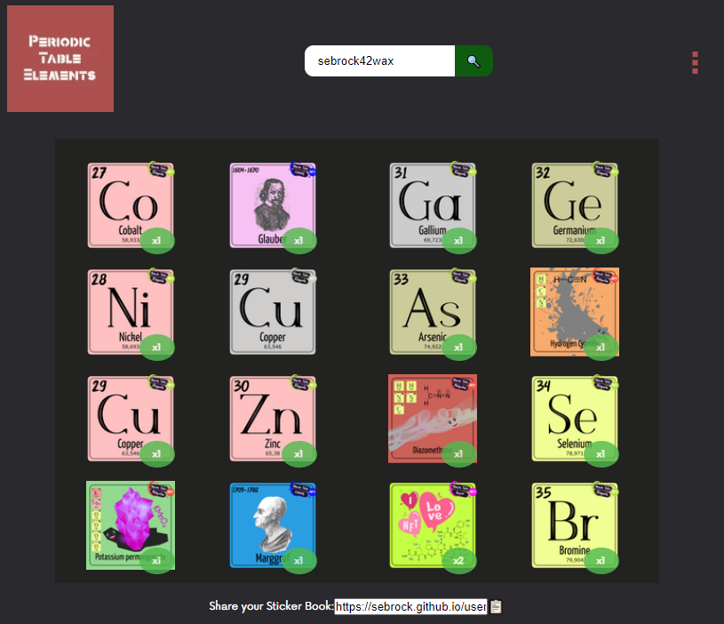

# Welcome to periodicelem-waxbook
A WAX NFT collection book made in React.
Adapted for the Periodic Table Of Elements - NFT collection (periodicelem) by sebrock.

This  is a community effort to support the Periodic Table NFT project and not endorsed by of affiliated with project.

All credit for the original [cryptomonKeys version](https://github.com/andrecrjr/cryptomonkey-stickerbook) goes to [andrecrjr](https://github.com/andrecrjr) 💛

 # The Periodic Table NFT project
The periodic table, also known as the periodic table of elements, is a tabular display of the chemical elements, which are arranged by atomic number, electron configuration, and recurring chemical properties. Each of us has a good memory of the school period. The periodic table of the elements was certainly a part of our journey. The time has come to retrace each element and collect the most exciting ones.

The Periodic Table NFT project aims to raise awareness of chemical elements in a modern key, basing the approach on blockchain and Non Fungible Token.

**Day after day it will be possible to know the single elements that make up the table, to collect curiosities about each of them and about the table in general.**

We are working to be able to learn, in a playful way, also what happens by combining the various elements.

The whole project is based on the collection of NFTs that can be bought on the site https://wax.atomichub.io/market?collection_name=periodicelem&order=desc&sort=created&symbol=WAX or by participating in simple giveaways published on publish0x.

# You want to know more about the project?
Check out the resources below
 ## [Buy periodicelem NFTs](https://wax.atomichub.io/market?collection_name=periodicelem&order=desc&sort=created&symbol=WAX)
 ## Check the [Blog on publish0x](https://www.publish0x.com/periodic-table-of-elements-nft/) frequently
 ## TAlk to the project on the [Telegram channel](https://t.me/periodicelem)
 ## Meet the community On the [WAX Ecosystem Discord](https://discord.gg/8mqYBywpuB): in the "all-projects" channel
